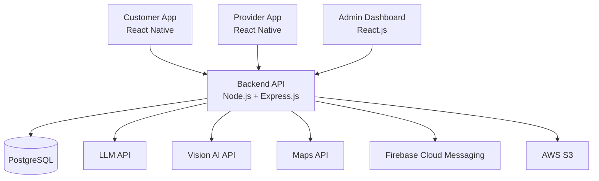

# On-Demand Skilled Services Platform Application

> An AI-powered marketplace that helps customers find the right, trusted, nearby skilled professional for household problems.

| | |
|---|---|
| **Team** | PixelPioneers |
| **Institution** | Sabaragamuwa University of Sri Lanka |
| **Status** | 🚧 Currently in Phase 1: Repository Initialization & Architecture |

---

## 1. Project Description

The On-Demand Skilled Services Platform connects households with verified skilled professionals such as plumbers, electricians, carpenters, masons, painters, AC/refrigeration technicians, appliance repairers, cleaners and gardeners.

The platform is planned to use AI to help customers describe their problem (in text or with a photo), identify the type of service they need, and match them with a suitable, nearby, trusted provider.

## 2. Problem Being Solved

Finding a reliable skilled worker for a household problem is often difficult:

- Customers do not always know **which type of professional** their problem needs.
- It is hard to find someone who is **nearby and available** at short notice.
- There is little **trust information** (verification, ratings, past work) to help choose a provider.
- Skilled workers lack a simple channel to **find customers** and manage job requests.

## 3. Target Users

| User | Description |
|---|---|
| **Customers** | Households that need a skilled professional for a repair, installation or maintenance task. |
| **Service Providers** | Independent skilled workers offering services such as plumbing, electrical work or cleaning. |
| **Administrators** | Platform staff who verify providers, manage categories and monitor platform activity. |

### Planned Service Categories

Plumbing · Electrical · Carpentry · Masonry · Painting · AC/Refrigeration Repair · Appliance Repair · Cleaning · Gardening

## 4. Planned Applications

| Application | Folder | Technology | Purpose |
|---|---|---|---|
| Customer App | [`customer-app/`](customer-app/) | React Native | Customers describe problems and book providers |
| Provider App | [`provider-app/`](provider-app/) | React Native | Providers receive and manage job requests |
| Admin Dashboard | [`admin-dashboard/`](admin-dashboard/) | React.js | Administrators manage the platform |
| Backend API | [`backend/`](backend/) | Node.js + Express.js | Central REST API used by all three clients |
| Database | [`database/`](database/) | PostgreSQL + Sequelize | Migrations and seed data |

## 5. Technology Stack

| Layer | Technology |
|---|---|
| Customer mobile app | React Native |
| Provider mobile app | React Native |
| Admin dashboard | React.js |
| Backend | Node.js, Express.js |
| Database | PostgreSQL |
| ORM | Sequelize |
| Authentication | JWT |
| AI | LLM API, Vision-capable AI API |
| Maps | Maps API |
| Push notifications | Firebase Cloud Messaging |
| File storage | AWS S3 |
| API testing | Postman |
| Version control | Git + GitHub |
| Deployment | Render / AWS |

## 6. High-Level Architecture

All client applications communicate **only** with the Backend API. The backend is the single place that talks to the database and to external services (AI, maps, notifications, storage), so no secrets are ever shipped inside the mobile or web apps.



More detail: [`docs/architecture/system-architecture.md`](docs/architecture/system-architecture.md)

## 7. Repository Structure

```
.
├── customer-app/        # React Native app for customers
├── provider-app/        # React Native app for service providers
├── admin-dashboard/     # React.js web dashboard for administrators
├── backend/             # Node.js + Express.js REST API
├── database/            # Sequelize migrations and seeders
├── docs/                # Architecture docs and decision records
├── .gitignore
└── README.md
```

Each application is self-contained with its own `package.json` and is installed and run independently.

## 8. Current Development Status

**Currently in Phase 1: Repository Initialization & Architecture**

- [x] Monorepo folder structure
- [x] Architecture documentation placeholders
- [x] Environment variable templates (`.env.example`)
- [ ] Application features — **not yet implemented**

No application features (authentication, AI, matching, bookings, payments, notifications, UI screens) have been implemented yet. They will be built in later phases.

## Security Note

Real credentials (API keys, database passwords, JWT secrets, AWS keys, Firebase service accounts) must **never** be committed. Copy each `.env.example` to `.env` locally and fill in your own values — `.env` files are ignored by Git.

---

© PixelPioneers — Sabaragamuwa University of Sri Lanka
