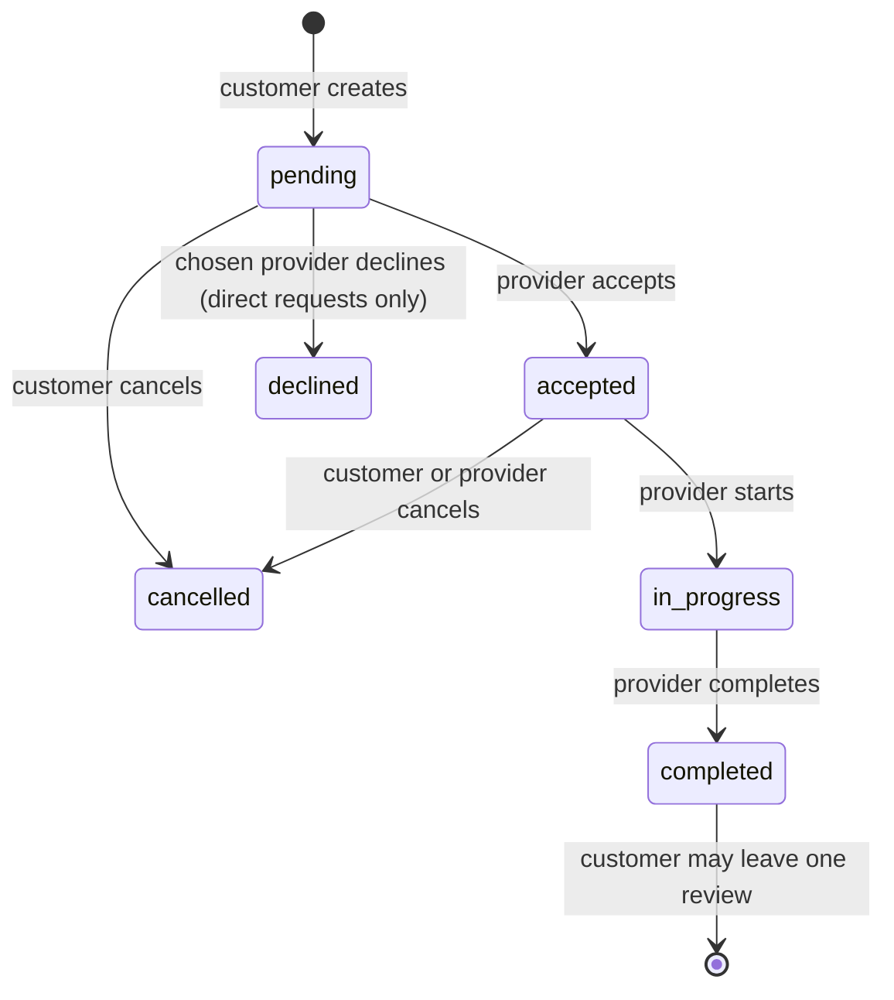

# API Specification

REST API for the Customer App, Provider App and Admin Dashboard.
Maintained by Member 3 (Backend). Every endpoint below is implemented and covered by tests in `backend/tests/`.

**Base URL (local):** `http://localhost:5000/api`

> Testing from a phone or emulator: `localhost` means the device itself. Use your computer's LAN IP (e.g. `http://192.168.1.20:5000/api`), or `http://10.0.2.2:5000/api` on the Android emulator.

---

## Conventions

### Authentication

Log in or register to get a JWT, then send it with every protected request:

```
Authorization: Bearer <token>
```

Tokens expire after `JWT_EXPIRES_IN` (default 1 day). On a `401`, send the user back to the login screen.

### Roles

| Role | Who | How the account is created |
|---|---|---|
| `customer` | Households | `POST /auth/register` (default role) |
| `provider` | Skilled workers | `POST /auth/register` with `"role": "provider"` |
| `admin` | Platform staff | `npm run create-admin` on the server only |

### Response format

Success:

```json
{ "success": true, "data": { ... }, "meta": { "page": 1, "limit": 20, "total": 42, "totalPages": 3 } }
```

`meta` is only present on paginated lists.

Error:

```json
{
  "success": false,
  "error": {
    "message": "Validation failed",
    "details": [{ "field": "email", "message": "A valid email is required" }]
  }
}
```

`details` is only present on validation errors — use it to show messages next to form fields.

### Status codes

| Code | Meaning |
|---|---|
| 200 / 201 | OK / Created |
| 400 | Invalid input (see `error.details`) |
| 401 | Missing, invalid or expired token — log in again |
| 403 | Logged in, but your role can't do this |
| 404 | Not found, **or** you're not allowed to see it |
| 409 | Conflict — e.g. email taken, job already accepted, wrong job status |
| 429 | Too many login/register attempts — wait 15 minutes |
| 500 | Server error |

### Pagination

List endpoints accept `?page=1&limit=20` (max `limit` is 100).

### IDs

All ids are integers. **A provider is always identified by their user id** — in `/providers/:id`, in `serviceRequest.providerId`, and in reviews.

---

## Endpoint Summary

| Method | Path | Auth | Used by |
|---|---|---|---|
| GET | `/health` | — | All |
| POST | `/auth/register` | — | Customer, Provider |
| POST | `/auth/login` | — | All |
| GET | `/auth/me` | Any role | All |
| PATCH | `/auth/me` | Any role | All |
| GET | `/categories` | — | All |
| POST | `/categories` | admin | Admin |
| PATCH | `/categories/:id` | admin | Admin |
| GET | `/providers` | — | Customer |
| GET | `/providers/:id` | — | Customer |
| GET | `/providers/:id/reviews` | — | Customer |
| GET | `/providers/me/profile` | provider | Provider |
| PATCH | `/providers/me/profile` | provider | Provider |
| PATCH | `/providers/:id/verification` | admin | Admin |
| POST | `/service-requests` | customer | Customer |
| GET | `/service-requests` | Any role | All |
| GET | `/service-requests/available` | provider | Provider |
| GET | `/service-requests/:id` | Any role | All |
| PATCH | `/service-requests/:id/accept` | provider | Provider |
| PATCH | `/service-requests/:id/decline` | provider | Provider |
| PATCH | `/service-requests/:id/start` | provider | Provider |
| PATCH | `/service-requests/:id/complete` | provider | Provider |
| PATCH | `/service-requests/:id/cancel` | Any role | All |
| POST | `/service-requests/:id/review` | customer | Customer |

---

## Auth

### `POST /auth/register`

| Field | Type | Required | Rules |
|---|---|---|---|
| `fullName` | string | yes | 2–100 chars |
| `email` | string | yes | valid email, unique (stored lowercase) |
| `password` | string | yes | 8–72 chars |
| `phone` | string | no | digits, spaces, `-`, optional leading `+` |
| `role` | string | no | `customer` (default) or `provider` |

`201` →

```json
{
  "success": true,
  "data": {
    "user": { "id": 1, "fullName": "Nimal Perera", "email": "nimal@example.com", "phone": null, "role": "customer", "isActive": true, "createdAt": "...", "updatedAt": "..." },
    "token": "eyJhbGciOi..."
  }
}
```

Registering as a provider also creates an empty provider profile. `409` if the email is taken.

### `POST /auth/login`

Body: `{ "email": "...", "password": "..." }` → `200` with the same shape as register.
`401` for a wrong email or password (same message for both). `403` if the account is deactivated.

### `GET /auth/me`

`200` → `{ "user": { ... } }`

### `PATCH /auth/me`

Body (all optional): `fullName`, `phone`. Other fields (role, email, password) are ignored. `200` → `{ "user": { ... } }`

---

## Categories

### `GET /categories`

Active categories, sorted by name. `200` →

```json
{ "categories": [{ "id": 1, "name": "Plumbing", "slug": "plumbing", "description": "...", "isActive": true }] }
```

### `POST /categories` — admin

Body: `name` (required), `description`. `201` → `{ "category": { ... } }`

### `PATCH /categories/:id` — admin

Body (all optional): `name`, `description`, `isActive`. `200` → `{ "category": { ... } }`

---

## Providers

### Provider object

```json
{
  "id": 3,
  "userId": 7,
  "bio": "Ten years fixing pipes",
  "yearsOfExperience": 10,
  "hourlyRate": 1500,
  "city": "Colombo",
  "latitude": 6.9271,
  "longitude": 79.8612,
  "isAvailable": true,
  "isVerified": true,
  "averageRating": 4.5,
  "totalReviews": 12,
  "user": { "id": 7, "fullName": "Kamal Silva" },
  "categories": [{ "id": 1, "name": "Plumbing", "slug": "plumbing" }]
}
```

Use `userId` (not `id`) when linking to a provider. Public endpoints never return a provider's email or phone.

### `GET /providers`

Query (all optional): `categoryId`, `city` (exact, case-insensitive), `available` (`true`/`false`), `verified` (`true`/`false`), `page`, `limit`.
Sorted by verified first, then highest rating. `200` → `{ "providers": [ ... ] }` + `meta`

### `GET /providers/:id`

`:id` = provider's user id. `200` → `{ "provider": { ... } }`

### `GET /providers/:id/reviews`

`200` → `{ "reviews": [{ "id": 1, "rating": 5, "comment": "...", "createdAt": "...", "customer": { "id": 2, "fullName": "..." } }] }` + `meta`

### `GET /providers/me/profile` — provider

`200` → `{ "profile": { ... } }`

### `PATCH /providers/me/profile` — provider

| Field | Type | Rules |
|---|---|---|
| `bio` | string | max 1000 chars |
| `yearsOfExperience` | integer | 0–80 |
| `hourlyRate` | number | ≥ 0 |
| `city` | string | max 100 chars |
| `latitude` / `longitude` | number | -90–90 / -180–180 |
| `isAvailable` | boolean | |
| `categoryIds` | integer[] | **replaces** the full list of categories offered |

All optional. `200` → `{ "profile": { ... } }`. `400` if a category id doesn't exist.

### `PATCH /providers/:id/verification` — admin

Body: `{ "isVerified": true }` → `200` → `{ "profile": { ... } }`

---

## Service Requests (jobs)

### Lifecycle



Two kinds of request:

- **Open** (no `providerId`): every provider offering that category sees it in `/available`. The first to accept gets it.
- **Direct** (`providerId` set): only that provider sees it, and can accept or decline.

Calling an action in the wrong status returns `409`, e.g. `Cannot start a service request with status "pending"`.

### Service request object

```json
{
  "id": 10,
  "customerId": 2,
  "providerId": 7,
  "categoryId": 1,
  "title": "Kitchen sink leaking",
  "description": "Water is leaking under the kitchen sink since this morning.",
  "address": "12 Main Street, Colombo",
  "latitude": null,
  "longitude": null,
  "preferredDate": "2026-10-10T09:00:00.000Z",
  "status": "accepted",
  "cancellationReason": null,
  "cancelledById": null,
  "acceptedAt": "...",
  "startedAt": null,
  "completedAt": null,
  "cancelledAt": null,
  "createdAt": "...",
  "updatedAt": "...",
  "customer": { "id": 2, "fullName": "Nimal Perera", "phone": "+94 71 234 5678" },
  "provider": { "id": 7, "fullName": "Kamal Silva", "phone": "+94 77 765 4321" },
  "category": { "id": 1, "name": "Plumbing", "slug": "plumbing" }
}
```

`provider` is `null` until a provider accepts. `GET /service-requests/:id` also includes `review` (or `null`).

### `POST /service-requests` — customer

| Field | Type | Required | Rules |
|---|---|---|---|
| `categoryId` | integer | yes | active category |
| `title` | string | yes | 3–150 chars |
| `description` | string | yes | 10–2000 chars |
| `address` | string | yes | 5–255 chars |
| `providerId` | integer | no | provider's user id → makes it a **direct** request |
| `latitude` / `longitude` | number | no | |
| `preferredDate` | string | no | ISO 8601, e.g. `2026-10-10T09:00:00Z` |

`201` → `{ "serviceRequest": { ... } }`

### `GET /service-requests`

"My jobs" — customers get their own requests, providers get jobs assigned to them, admins get everything.
Query: `status`, `page`, `limit`. Newest first. `200` → `{ "serviceRequests": [ ... ] }` + `meta`

### `GET /service-requests/available` — provider

The provider's job feed: pending open requests in their categories, plus direct requests sent to them. Oldest first.
`200` → `{ "serviceRequests": [ ... ] }` + `meta`

### `GET /service-requests/:id`

Visible to the customer who created it, the assigned provider, providers who could accept it, and admins. Otherwise `404`.

### Provider actions — `PATCH /service-requests/:id/{accept|decline|start|complete}`

No body. `200` → `{ "serviceRequest": { ... } }`

| Action | Allowed when |
|---|---|
| `accept` | `pending`, and either open in one of your categories or sent directly to you |
| `decline` | `pending` and sent directly to you |
| `start` | `accepted` by you |
| `complete` | `in_progress` by you |

### `PATCH /service-requests/:id/cancel`

Body: `{ "reason": "optional, max 500 chars" }`

| Role | Can cancel when |
|---|---|
| customer (owner) | `pending` or `accepted` |
| provider (assigned) | `accepted` |
| admin | `pending`, `accepted` or `in_progress` |

### `POST /service-requests/:id/review` — customer

Body: `{ "rating": 1-5, "comment": "optional, max 1000 chars" }`. Only for your own `completed` requests, once.
Updates the provider's `averageRating` and `totalReviews`. `201` → `{ "review": { ... } }`

---

## Not Yet Available

Planned for later phases: AI problem classification (text + photo), distance-based nearby search, push notifications, photo uploads, payments.
