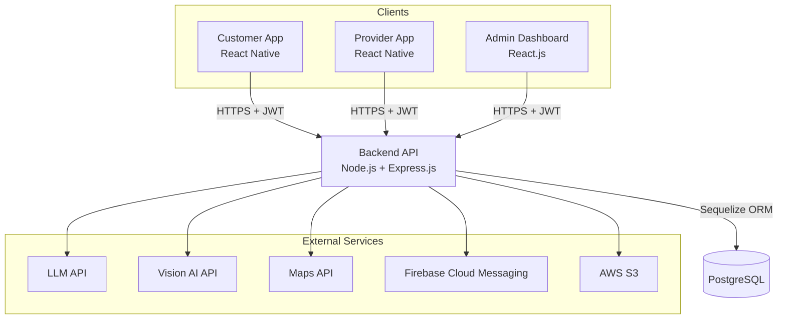
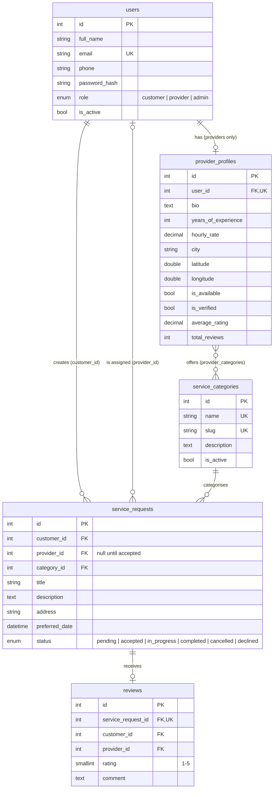
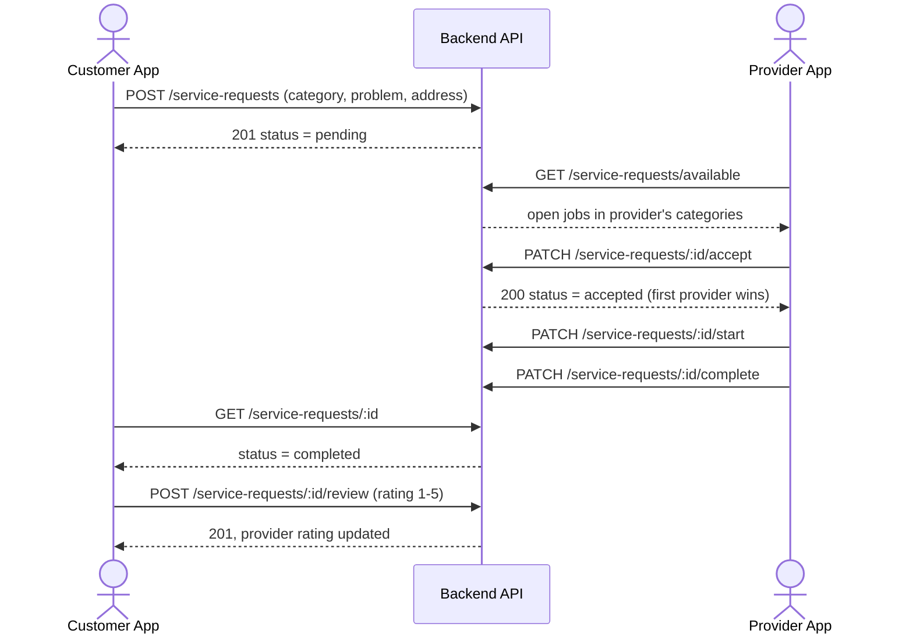

# System Architecture

> Status: Core backend implemented (auth, categories, providers, service requests, reviews). External integrations are planned.

## Overview

The platform consists of three client applications and one backend API. The backend is the **only** component that accesses the database and external services.



## Components

| Component | Responsibility |
|---|---|
| **Customer App** | Customers describe a household problem, view suggested providers and manage bookings. |
| **Provider App** | Providers manage their profile and availability and respond to job requests. |
| **Admin Dashboard** | Administrators verify providers, manage service categories and monitor activity. |
| **Backend API** | Authentication, authorization (roles), business rules, provider matching and all external integrations. |
| **PostgreSQL** | Persistent storage for users, providers, services, bookings and reviews. |

## External Integrations (backend only)

| Service | Planned use | Backend location |
|---|---|---|
| LLM API | Understand the customer's problem description and suggest a service category | `backend/src/services/ai/` |
| Vision AI API | Analyse photos of the problem uploaded by the customer | `backend/src/services/ai/` |
| Maps API | Locations, distances and nearby provider search | `backend/src/services/matching/` |
| Firebase Cloud Messaging | Push notifications to the mobile apps | `backend/src/services/notifications/` |
| AWS S3 | Storing uploaded images (problem photos, profile photos, documents) | `backend/src/services/storage/` |

## Key Principles

1. **Clients never hold secrets.** API keys for AI, maps (server-side), S3 and Firebase Admin stay in the backend.
2. **Layered backend.** Routes → Middleware → Controllers → Services → Models.
3. **Role-based access.** Every authenticated request carries a JWT that identifies the user and role (`customer`, `provider`, `admin`).

## Backend Request Flow

```
Request → Route → Middleware (authenticate, authorize role, validate) → Controller → Service → Model → PostgreSQL
```

| Layer | Folder | Responsibility |
|---|---|---|
| Route | `backend/src/routes/` | Maps URL + HTTP method to middleware and a controller. No logic. |
| Middleware | `backend/src/middleware/` | JWT authentication, role checks, validation errors, error responses. |
| Validator | `backend/src/validators/` | Rules for request body, params and query. |
| Controller | `backend/src/controllers/` | Reads validated input, calls a service, sends the JSON response. |
| Service | `backend/src/services/` | Business rules (e.g. who may accept a job) and database work. |
| Model | `backend/src/models/` | Sequelize models and relationships. |

The full endpoint list is in [API_SPEC.md](API_SPEC.md).

## Data Model

Schema is created by the migrations in [`database/migrations/`](../database/migrations/).



## Booking Flow



## To Be Documented

- Deployment architecture (Render / AWS)
- AI, maps, notification and storage integrations once built
